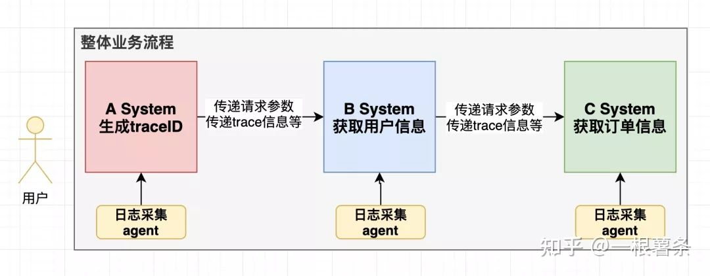
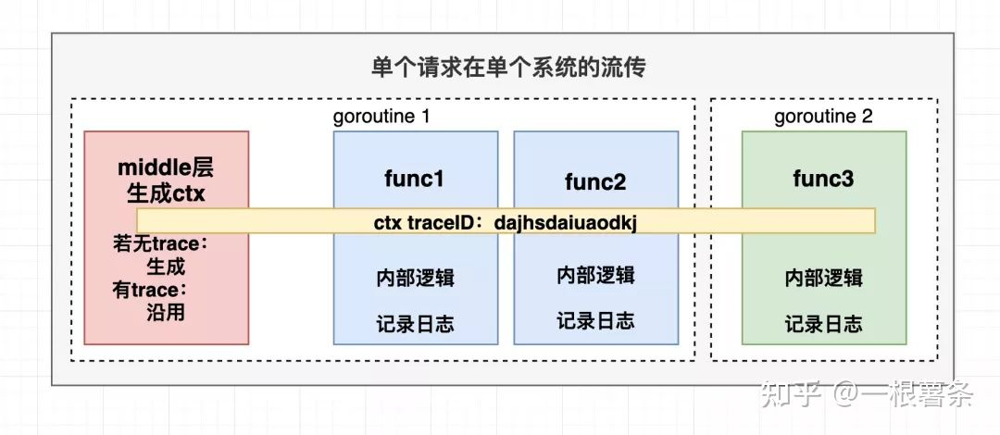
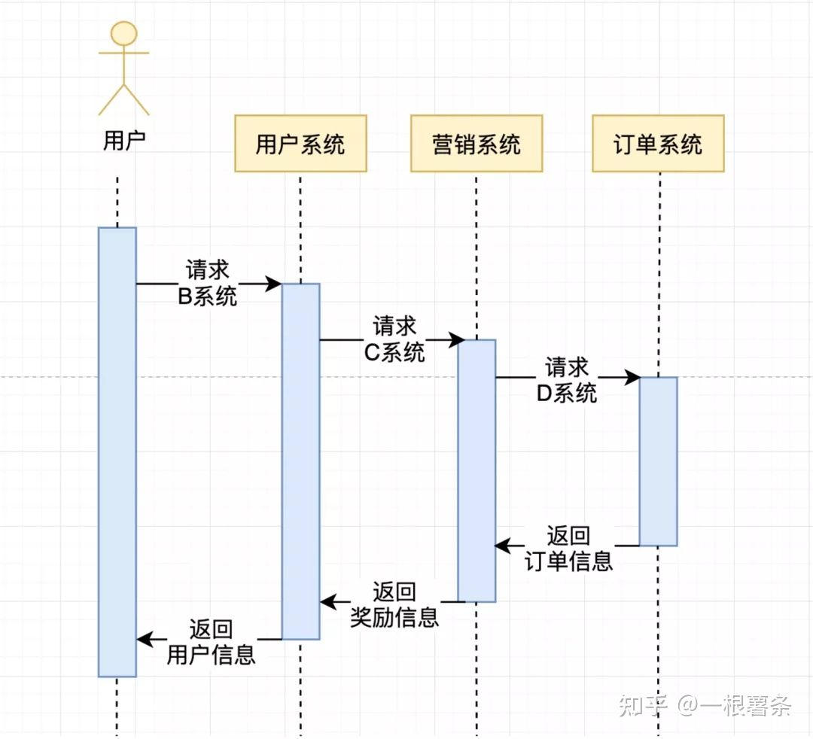

A：老板，有个需求我搞不定，需求：
```
用户发送 开始消费 请求时，开启多个协程开始消费消息队列某个topic的信息；
用户发送 结束消费 请求时，把消费中的topic相关的协程关闭掉，结束消费；
```
A：我之前写过的并发代码，都是开个 WaitGroup 等所有协程处理完后继续执行后续逻辑，这种根据用户请求关闭协程的代码该怎么写啊？

B：控制多个协程的关闭？听起来可以用channel或Context来做。

A：噢，我把channel给忘了，这里可以用channel发信号关闭协程，不过Context怎么处理呢？

B：只需要相关协程监听Context的Done信号，就可以控制关闭多个协程了。你理解的Context是做什么的？

A：我还真没研究过这玩意，对Context的印象就是这这玩意在项目中到处都是，很多时候调用函数时把它当第一个参数传递，打日志时也要把ctx传入函数里。不过为啥这么做我也不清楚。

B：不管是函数参数，还是打日志，都是在用context传递请求上下文，至于原理，且听我来给你介绍：

跨服务传递信息

现在具备一定规模的互联网公司都用微服务形式让各系统组合起来为用户提供服务，一个简单的业务在流程上可能需要十几个甚至几十个系统间互相调用。由于每个系统内部的正确性无法保证，若出现了case，比如用户反馈积分少发了，就需要排查这十几个系统的日志信息，看问题出在哪里。

此处需要一个ID凭证，ID是请求级别的，在各个系统中记录着与此请求相关的日志信息，我们把它叫做trace ID。把日志采集并落盘到ES这样的存储中，有case时只需要拿到请求的trace ID就可以把全流程的关键信息还原出来。如图所示：



在Golang web服务中，每个请求都是开一个协程去处理的。系统间传递信息时，若通信协议用HTTP，那trace ID等信息可放在HTTP Header中，在web框架的middle层把这些信息存入Context。demo如下：
```
// 检测上游服务是否传递traceID信息，若传递了直接使用
if v, ok := req.Header["my-awesome-trace-ID"]; ok {
      traceID = v[0]
} else {
  // 若没传则用公共库生成一个全局唯一的traceID信息
  traceID = GenTraceID()
  req.Header["my-awesome-trace-ID"] = []string{traceID}
}
// 处理完各种请求上下文信息后，把这些信息统一存储到ctx中，传递给业务层的对应Handler
ctx = context.WithValue(ctx, ContentKey, record)
```
Context处理请求上下文这块主要用到了WithValue，这个函数接收一个ctx和一对k-v。把k-v对存起来后返回一个子ctx，这次我们先简单介绍其使用场景，下篇文章会从源码层面理解这个函数。


ctx的生命周期是 伴随请求开始而诞生、请求结束而终止的。在请求中ctx会跨越多个函数多个协程，在打日志时，第一个参数预留给ctx是因为日志库需要从Context中抽取trace ID等信息，从而记录下完整的日志。获取信息时只需要调用context的Value方法，demo如下：
```
// 从Context中获取traceID, 打到日志里
v := ctx.Value("my-awesome-trace-ID")
```
这里画个图帮助理解：



若我们的系统也需要请求第三方服务，同样应把trace ID等信息放入HTTP Header后发送请求，其他服务按照同样的流程接收到trace ID后开始内部逻辑处理。这样一个请求在多个系统中就通过trace ID串联起了整个流程。除trace ID外，Context还可以传递 URL Path、请求时间、Caller等信息。

A：厉害了老板，经过你的讲解，我现在已经知道context怎么用了。

B：汗，刚刚的传递上下文只是context三大功能的一块，另外context还有一块很重要的功能是取消机制，控制子协程取消和超时取消机制还没讲呢。

A：对哦，我最开始的需求你还没告诉我用Context如何控制多个协程的关闭呢？

B：这块也挺简单，你把相关代码贴出来：

多协程消费demo：
```
func main() {
  // 此协程负责监听错误信息，开启消费
  go func() {
    for {
      select {
      // code
      }
    }
  }()
​
  // 此协程负责监听re-balance信息，开启消费
  go func() {
    for {
      select {
      // code
      }
    }
  }()
  // ...
}
```
B：要通过Context关闭所有协程，可以这样改造代码：
```
func main() {
  ctx, cancel := context.WithCancel(context.Background())
​
  // 此协程负责监听错误信息，开启消费
  go func() {
    for {
      select {
      case <-ctx.Done():
        fmt.Println("退出监听错误协程")
        return
      default:
        fmt.Println("逻辑处理中...")
      }
    }
  }()
​
  // 此协程负责监听re-balance信息，开启消费
  go func() {
    for {
      select {
      case <-ctx.Done():
        fmt.Println("退出监听re-balance协程")
        return
      default:
        fmt.Println("逻辑处理中...")
      }
    }
  }()
​
  // 调用cancelFunc, 结束消费
  cancel()
}
```
控制协程关闭


调用context的WithCancel方法会返回一个可被取消的ctx和CancelFunc，需要取消ctx时，调用cancel函数即可。而context有个Done方法，这个方法返回一个channel，当Context被取消时，这个channel会被关闭。消费中的协程通过select监听这个channel，收到关闭信号后一个return就能结束消费。

CancelFunc主要用途是预防系统做不必要的工作。比如用户请求A接口时，A接口内部需要请求A database、B cache 、C System获取各种数据，把这些数据经过计算后组装到一起返回给调用方。这是正常情况的时序图：



但如果用户在访问网站时觉得没意思，去其他网站了。此时若你的服务收到用户请求后继续去访问其他C system、B database就是浪费资源。比较符合直觉的做法是：当业务请求取消时，你的系统也应该停止请求下游系统。前面我们介绍过context在系统中贯穿请求周期，那么当用户取消访问时，只要context监听取消事件并在用户取消时发送取消事件，就可以取消请求了。


这里有份demo代码，项目启动后，可以用curl localhost:8888访问这个接口，若1s内取消请求，服务端会打印出request canceleld，正常情况下，服务会返回process finished。
```
func main() {
  http.ListenAndServe(":8888", http.HandlerFunc(func(w http.ResponseWriter, r *http.Request) {
    ctx := r.Context()
    fmt.Println("get request")
    select {
    case <-time.After(1 * time.Second):
      w.Write([]byte("process finished"))
    case <-ctx.Done():
      fmt.Println("request canceleld")
    }
  }))
}
```
除了用户中途取消请求的情况，还有一种情况也可以用到cancelFunc：服务A的返回数据依赖服务B和服务C的相关接口，若服务B或者服务C挂了，此次请求就算失败了，没必要再访问另一个服务，此时也可以用CancelFunc。Demo如下：
```
func getUserInfoBySystemA(ctx context.Context) error {
  time.Sleep(100 * time.Millisecond)
  // 模拟请求出错的情况
  return errors.New("failed")
}
​
func getOrderInfoBySystemB(ctx context.Context) {
  select {
  case <-time.After(500 * time.Millisecond):
    fmt.Println("process finished")
  case <-ctx.Done():
    fmt.Println("process cancelled")
  }
}
​
func main() {
  ctx, cancel := context.WithCancel(context.Background())
​
  //并发从两个服务中获取相关数据
  go func() {
    err := getUserInfoBySystemA(ctx)
    if err != nil {
      // 发生错误，调用cancelFunc
      cancel()
    }
  }()
​
  getOrderInfoBySystemB(ctx)
}
```
A：原来cancelFunc是这么用的，我觉得我行了，context我差不多会了，除了你说的超时控制。

B：超时机制你应该也可以想象出来，你知道SLA(service level agreement)吗？

A：知道，SLA就是服务对外承诺的请求最长持续时间，比如我们的服务对外承诺的SLA就是99分位100ms。在Golang里，SLA可以通过Context做的？

B：是的，可以通过Context的WithTimeout做：


控制超时取消


如果你的服务对外承诺的SLA是100ms，但系统依赖的服务B的HTTP接口有点不稳定，有时50ms就能返回结果，有时100ms才能返回结果，为了保证你服务的SLA，可以用Context的WithTimeout方法设置一个超时时间，demo如下：
```
func main() {
  // 设置超时时间100ms
  ctx, _ := context.WithTimeout(context.Background(), 100*time.Millisecond)
​
  // 构建一个HTTP请求
  req, _ := http.NewRequest(http.MethodGet, "https://www.baidu.com/", nil)
  // 把ctx信息传进去
  req = req.WithContext(ctx)
​
  client := &http.Client{}
  // 向百度发送请求
  res, err := client.Do(req)
  if err != nil {
    fmt.Println("Request failed:", err)
    return
  }
  fmt.Println("Response received, status code:", res.StatusCode)
}
```
正常情况下，会得到这样的输出：

Response received, status code: 200
如果我们请求百度超时了，会得到这样的输出：

Request failed: Get https://www.baidu.com/: context deadline exceeded

A：厉害了，原来SLA可以这样搞，这次我算了解到Context的使用场景了。现在我对Context的源码充满了好奇。

B：篇幅有限，写多了读者也不爱看，关于Context源码和使用时的注意点，我们下篇文章聊聊吧。

源码分析
ctx存储键值对
ctx的取消机制
源码赏析
if >= 2 用switch替换
atomic.Value 替换chan struct 减少锁使用
加锁前，先获取值避免加锁
String逻辑赏析
一个Bug
总结


源码分析

context的核心作用是存储键值对和取消机制。存储键值对比较简单，取消机制比较复杂，先来看一下Context抽象出来的接口：

type Context interface {
  // 如果是timerCtx或者自定义的ctx实现了此方法，返回截止时间和true，否则返回false
 Deadline() (deadline time.Time, ok bool)
  // 这里监听取消信号
  Done() <-chan struct{}
  // ctx取消时，返回对应错误，有context canceled和context deadline exceeded
  Err() error 
  // 返回key的val
 Value(key interface{}) interface{}
}
ctx存储键值对

要新建一个存储键值对的ctx，需要调用WithValue，它返回一个valueCtx地址对象。valueCtx结构体内部内部很简单，有个Context接口和k-v对：

type valueCtx struct {
 Context
 key, val interface{}
}
valueCtx实现了Value方法，逻辑也很简单：

func (c *valueCtx) Value(key interface{}) interface{} {
  // key相同则返回key
  if c.key == key {
  return c.val
 }
  // 否则从父节点中调用Value方法继续寻找key
 return c.Context.Value(key)
}
简单写一段代码看一下从valueCtx中查找某个key的过程：

func main() {
 ctx := context.Background()

 ctx1 := context.WithValue(ctx, "name", "uutc")
 ctx2 := context.WithValue(ctx1, "age", "18")
 ctx3 := context.WithValue(ctx2, "traceID", "89asd7yu9asghd")

 fmt.Println(ctx3.Value("name"))
}
valueCtx是个链表模型，当我们从ctx3中查找name这个key, 最终要走到ctx1中才能返回对应的value，如图所示：


虽然链表的查找效率是O(n)的，但貌似一个请求里面也不会1000层ctx，个人认为ctx链表查找效率可以接受，读者有兴趣可以给go团队提个pr，把链表改成红黑树试试，嘿嘿~

ctx的取消机制

context的取消机制我个人认为可以分成两种：第一种是普通取消，需要取消ctx时调用cancel函数。第二个是根据时间取消，用户可以定义一个过期time或一个deadline，到这个时间时自动取消。源码中时间取消基于普通取消之上实现的。

普通取消

现在不看源码，联想一下如果我们自己该如何实现取消机制： 建立ctx时, 是在parent的基础上copy一份，然后添加自己的属性, 不同协程可能持有不同的ctx,若想在请求层面做协程取消，就需要广播机制，比如在下图中：


若我们要取消ctx2，应分为向上取消和向下取消两部分，向下取消要把当前节点的子节点都干掉，在这里需要tx4、ctx5都取消掉，而向上取消需要把他在父节点中删除，在这里需要把自己(ctx2)从父节点ctx的子节点列表中删除；

取消这个动作本身并没有神奇的地方，每个ctx创建一个channel，然后协程通过select去监听这个channel，没数据时处于阻塞状态，当调用取消函数，函数内部执行close(chan)操作, select监听到关闭信号执行return，以此达到取消的目的，写个demo：

func main() {
 done := make(chan struct{})

 go func() {
  close(done)
 }()

 select {
 case <-done:
  println("exit!")
  return
 }
}
来看go源码是怎么实现的取消，首先抽象出了一个canceler接口，这个接口里最重要的就是cancel方法，调用这个方法可以发送取消信号，有两个结构体实现了这个接口，分别是 *cancelCtx(普通取消) 和 *timerCtx(时间取消)。

type canceler interface {
 cancel(removeFromParent bool, err error)
 Done() <-chan struct{}
}
cancelCtx对应前文说的普通取消机制，它是context取消机制的基石，也是源码中比较难理解的地方，先来看一下它的结构体：

type cancelCtx struct {
 Context

 mu       sync.Mutex            // context号称并发安全的基石
 done     atomic.Value          // 用于接收ctx的取消信号，这个数据的类型做过优化，之前是 chan struct 类型
 children map[canceler]struct{} // 储存此节点的实现取消接口的子节点，在根节点取消时，遍历它给子节点发送取消信息
 err      error                 // 调用取消函数时会赋值这个变量
}
若我们要生成一个可取消的ctx，需要调用WithCancel函数，这个函数的内部逻辑是：

func WithCancel(parent Context) (ctx Context, cancel CancelFunc) {
 if parent == nil {
  panic("cannot create context from nil parent")
 }
 c := newCancelCtx(parent)    // 基于父节点，new一个CancelCtx对象
 propagateCancel(parent, &c)  // propagateCancel负责在父ctx取消时让子ctx取消
 return &c, func() { c.cancel(true, Canceled) } // 返回子ctx，和返回函数
}
这里逻辑比较重的地方是propagateCancel函数和cancel方法，propagateCancel函数主要工作是把子节点挂载父节点上，下面来看看它的源码：

func propagateCancel(parent Context, child canceler) {
 done := parent.Done()
  // 判断父节点的done是否为nil,若为nil则为不可取消的ctx, 直接返回
 if done == nil {
  return
 }
  // 看能否从done里面读到数据，若能说明父节点已取消，取消子节点，返回即可，不能的话继续流转到后续逻辑
 select {
 case <-done:
  child.cancel(false, parent.Err())
  return
 default:
 }

  // 调用parentCancelCtx函数，看是否能找到ctx上层最接近的可取消的父节点
 if p, ok := parentCancelCtx(parent); ok {
    //这里是可以找到的情况
  p.mu.Lock()
  // 父节点有err，说明已经取消，直接取消子节点
    if p.err != nil {
   child.cancel(false, p.err)
  } else {
      // 把本节点挂载到父节点的children map中
   if p.children == nil {
    p.children = make(map[canceler]struct{})
   }
   p.children[child] = struct{}{}
  }
  p.mu.Unlock()
 } else {
    // 若没有可取消的父节点挂载
  atomic.AddInt32(&goroutines, +1)
  // 新起一个协程
    go func() {
   select {
      // 监听到父节点取消时，取消子节点
   case <-parent.Done():
    child.cancel(false, parent.Err())
      // 监听到子节点取消时，什么都不做，退出协程
   case <-child.Done():
   }
  }()
 }
}
我看这段源码时产生了两个问题：

函数内部的 parentCancelCtx 函数中有个else分支，什么条件下会走到这里
调用cancel方法需要传递bool值，何时传true，何时传false
经过一番研究，大概解决了这俩问题，下面依次做解答。

什么条件下会走到parentCancelCtx 函数的else分支

首先看下parentCancelCtx 函数的逻辑。parentCancelCtx函数用来查找ctx最近的一个可取消的父节点，这个函数也经过了优化，原代码是：

func parentCancelCtx(parent Context) (*cancelCtx, bool) {
 for {
  switch c := parent.(type) {
  case *cancelCtx:
   return c, true
  case *timerCtx:
   return &c.cancelCtx, true
  case *valueCtx:
   parent = c.Context
  default:
   return nil, false
  }
 }
}

这段代码比较简单，起了一个for循环，遇到*cancelCtx和*timerCtx类型就返回，遇到*valueCtx则继续向上查找parent，直到找到了节点或者找不到为止。

最新版本的代码放弃粗暴的使用for{}循环寻找父节点，而是用parent.Value方法查到父节点是否能找到特定的key，由于Value是递归的，所以这里表面上有点看不出来：

func parentCancelCtx(parent Context) (*cancelCtx, bool) {
 done := parent.Done()
 if done == closedchan || done == nil {
  return nil, false
 }
 // Value是递归向上查找，直到找到有*cancelCtxKey 的ctx为止
 p, ok := parent.Value(&cancelCtxKey).(*cancelCtx)
 if !ok {
  return nil, false
 }
 pdone, _ := p.done.Load().(chan struct{})
 if pdone != done {
  return nil, false
 }
 return p, true
}
知道了这个前提，我们继续研究什么条件下会走到parentCancelCtx 函数的else分支：

我自己实现了一个Context，代码如下

type ContextCancel struct {
 context.Context
}

func (*ContextCancel) Done() <-chan struct{} {
 ch := make(chan struct{}, 100)
 return ch
}
当调用这段代码时，即可走到else分支：

func main() {
 ctx := context.Background()
 ctx1, _ := context.WithCancel(ctx)
 ctx2 := context.WithValue(ctx1, "hello", "world")
 ctx3 := ContextCancel{ctx2}
 ctx4, _ := context.WithCancel(&ctx3)  // 这里可以走到else分支

 println(ctx4)
}
与源码中CancelCtx不同的是，我这里的Done方法只是简单返回，并没有把done的值存到Context中去。所以在执行parentCancelCtx时，这里会判断失败，返回false：

pdone, _ := p.done.Load().(chan struct{})
if pdone != done {
 return nil, false
}
通过parent.Value(&cancelCtxKey).(*cancelCtx)虽然找到了cancelCtx，但是在load Done方法值的时候却铩羽而归，parentCancelCtx 这里判断失败，最终返回nil和false，最终走到else分支。所以这个else分支主要是预防用户自己实现了一个定制的Ctx中，随意提供了一个Done chan的情况的，由于找不到可取消的父节点的，只好新起一个协程做监听。

调用cancel方法需要传递bool值，何时传true，何时传false

要明白这个问题，先来看一下*cancelCtx类型的cancel方法实现：

func (c *cancelCtx) cancel(removeFromParent bool, err error) {
 // 取消时必须传入err，不然panic
  if err == nil {
  panic("context: internal error: missing cancel error")
 }
 c.mu.Lock()
  // 已经出错了，说明已取消，直接返回
 if c.err != nil {
  c.mu.Unlock()
  return
 }
  // 用户传进来的err赋给c.err
 c.err = err
 d, _ := c.done.Load().(chan struct{})
 if d == nil {
    // 这里其实和关闭chan差不多，因为后续会用closedchan作判断
  c.done.Store(closedchan)
 } else {
    // 关闭chan
  close(d)
 }
  // 这里是向下取消，依次取消此节点所有的子节点
 for child := range c.children {
  child.cancel(false, err)
 }
  // 清空子节点
 c.children = nil
 c.mu.Unlock()
  // 这里是向上取消，取消此节点和父节点的联系
 if removeFromParent {
  removeChild(c.Context, c)
 }
}
removeChild函数的逻辑比较简单，核心就是调用delete方法，在父节点的子节点中清空自己。

func removeChild(parent Context, child canceler) {
   p, ok := parentCancelCtx(parent)
   if !ok {
      return
   }
   p.mu.Lock()
   if p.children != nil {
      delete(p.children, child) // 这里只是删除一个
   }
   p.mu.Unlock()
}
看完这俩函数的逻辑后，这个问题也可以回答。当父节点调用cancel函数时传递true， 其他情况传递false。

true用来向上删除，核心逻辑是调用removeChild函数里面的的：

if p.children != nil {
  delete(p.children, child) // 这里只是删除一个
}
而false就是用来非向上删除，只需要执行完cancel方法这段代码即可：

for child := range c.children {
  child.cancel(false, err) // 这里把子节点都干掉
}
看到这里，ctx的普通取消机制基本差不多了，下面来看一下基于时间的取消机制：

时间取消

时间取消ctx可传入两种时间，第一种是传入超时时间戳；第二种是传入ctx持续时间，比如2s之后ctx取消，持续时间在实现上是在time.Now的基础上加了个timeout凑个超时时间戳，本质上都是调用的WithDeadline函数。

WithDeadline 函数内部new了一个timerCtx，先来看一下这个结构体的内容：

type timerCtx struct {
 cancelCtx
 timer *time.Timer  // 一个统一的计时器，后续通过 time.AfterFunc 使用
 deadline time.Time // 过期时间戳
}
可以看到 timerCtx 内嵌了cancelCtx，实际上在超时取消这件事上，timerCtx更多负责的是超时相关的逻辑，而取消主要调用的cancelCtx的cancel方法。先来看一下WithDeadline函数的逻辑，看如何返回一个时间Ctx：

func WithDeadline(parent Context, d time.Time) (Context, CancelFunc) {
 // 若父节点为nil，panic
 if parent == nil {
  panic("cannot create context from nil parent")
 }
 // 如果parent有超时时间、且过期时间早于参数d，那parent取消时，child 一定需要取消，直接通过WithCancel走起
 if cur, ok := parent.Deadline(); ok && cur.Before(d) {
  // The current deadline is already sooner than the new one.
  return WithCancel(parent)
 }
 // 构造一个timerCtx, 主要传入一个过期时间
 c := &timerCtx{
  cancelCtx: newCancelCtx(parent),
  deadline:  d,
 }
 // 把这个节点挂载到父节点上
 propagateCancel(parent, c)
 dur := time.Until(d)
 // 若子节点已过期，直接取消
 if dur <= 0 {
  c.cancel(true, DeadlineExceeded) // deadline has already passed
  return c, func() { c.cancel(false, Canceled) }
 }
 c.mu.Lock()
 defer c.mu.Unlock()
 if c.err == nil {
  // 否则等到过期时间时，执行取消操作
  c.timer = time.AfterFunc(dur, func() {
   c.cancel(true, DeadlineExceeded)
  })
 }
 // 返回一个ctx和一个取消函数
 return c, func() { c.cancel(true, Canceled) }
}
看完源码可以知道，除了基于时间的取消，当调用CancelFunc时，也能取消超时ctx。再来看一下*timerCtx的cancel方法的源码：

func (c *timerCtx) cancel(removeFromParent bool, err error) {
 // 调用cancel的cancel取消掉它下游的ctx
 c.cancelCtx.cancel(false, err)
 // 取消掉它上游的ctx的连接
 if removeFromParent {
  removeChild(c.cancelCtx.Context, c)
 }
 // 把timer停掉
 c.mu.Lock()
 if c.timer != nil {
  c.timer.Stop()
  c.timer = nil
 }
 c.mu.Unlock()
}
至此，context源码分析的差不多了，关于这块还有个挺常见的问题，Context.TODO和Context.Backend的区别。从代码上看，他俩没啥区别，都只是emptyCtx的对象而已，emptyCtx源码很简单，这里不再赘述。

源码赏析

写这篇文章时，我在想看源码的好处什么。个人认为有两点，第一可以从源码角度看到一个概念的全部细节，第二个是可以学习大牛写代码的思路。实际上context的代码也有个迭代过程，下面列举一些阅读源码时学习到的点：

if >= 2 用switch替换


来自String() string方法。

atomic.Value 替换chan struct 减少锁使用


来自cancelCtx源码，用atomic.Value类型替换了chan struct{}。

加锁前，先获取值避免加锁

这点在go源码中随处可见，简单列举几处：


看源码时就感觉这个select有点突兀，一看果然为优化效率后加的~


String逻辑赏析


之前的源码只是粗暴的使用Sprintf函数，后来自己搞了个stringer接口，用反射去打印Context。

一个Bug


截止日期已经过了，cancel已经执行过了，没必要在返回取消函数中再从父ctx中取消自己了. 感觉removeFromParent有点没抽象好，这不，作者自己都掉坑里去了。

总结

个人感觉context代码挺值得一看的：struct里面嵌套interface，struct并不对外暴露，而是提供多个Withxxx方法新建对象；interface对外暴露，用户可以根据需要构建自己的Context；timerCtx struct里面嵌套CancelCtx struct以此来复用cancel的逻辑等等。